# TechShop Backend Database And Business Flows

Tai lieu nay giai thich database model va cac luong nghiep vu chinh cua backend
TechShop theo code hien tai. Neu can tra cuu endpoint, doc
`docs/BACKEND_API_REFERENCE.md`. Neu can tra cuu tung file, doc
`docs/BACKEND_STRUCTURE.md`.

## 1. Tong Quan Domain

Backend xoay quanh 7 mien chinh:

| Mien | Bang/entity | Chuc nang |
|---|---|---|
| Auth/User | `Roles`, `Users`, `RefreshTokens`, `Addresses` | Tai khoan, quyen, refresh token, dia chi. |
| Catalog | `Categories`, `Products`, `ProductImages`, `ProductVariants`, `Specifications` | Danh muc, san pham, anh, bien the, thong so. |
| Cart | `Carts`, `CartItems`, `Coupons` | Gio hang guest/user, item theo variant, ma giam gia. |
| Order | `Orders`, `OrderItems`, `OrderStatusLogs` | Don hang, snapshot item, lich su trang thai. |
| Payment | `Payments` | COD/VNPay/Momo, trang thai thanh toan, transaction code. |
| Promotion | `Promotions`, `PromotionProducts` | Chuong trinh khuyen mai va product duoc gan. |
| Inventory/Review | `Inventory`, `InventoryLogs`, `Reviews` | Ton kho theo variant, log kho, danh gia san pham. |

## 2. Entity Map

### Auth/User

`Role`

- Primary key: `RoleId`.
- Unique: `RoleName`.
- Role seed: `Admin`, `Staff`, `Customer`.

`User`

- Primary key: `UserId` GUID.
- Unique: `Email`.
- Password luu bang `PasswordHash`, hash bang BCrypt.
- Co `RoleId`, `IsActive`, timestamps.
- Navigation: `Role`, `RefreshTokens`, `Addresses`, `Carts`.

`RefreshToken`

- Gan voi `UserId`.
- Co `Token`, `ExpiresAt`, `IsRevoked`, `CreatedAt`.
- Login tao token moi; refresh revoke token cu va tao replacement.

`Address`

- Dia chi giao hang theo user.
- Hien tai order API dang nhan dia chi dang text, chua dung `AddressId`.

### Catalog

`Category`

- Primary key: `CategoryId`.
- Unique: `Slug`.
- Ho tro category cha/con bang `ParentId`.
- `IsActive` de an category.

`Product`

- Primary key: `ProductId` GUID.
- Unique: `Slug`.
- Gia chinh: `BasePrice`; gia sale optional: `SalePrice`.
- `Brand`, `ThumbnailUrl`, `Tags`, `IsFeatured`, `IsActive`.
- Navigation: `Category`, `Images`, `Variants`, `Specifications`, `Reviews`.

`ProductImage`

- Anh thuoc product.
- `SortOrder` dung de sap xep gallery.

`ProductVariant`

- Bien the san pham.
- Unique: `SKU`.
- Thuoc product, co `Color`, `RAM`, `Storage`, `PriceOffset`, `IsActive`.
- Moi variant co the co 1 `Inventory`.

`Specification`

- Key-value thong so ky thuat theo product.
- `SortOrder` dung de hien thi.

### Cart/Coupon

`Cart`

- Co the gan voi `UserId` neu user da dang nhap.
- Co the gan voi `SessionId` neu guest.
- Co optional `CouponId`.
- Navigation: `Items`, `Coupon`.

`CartItem`

- Thuoc cart va tro toi `VariantId`.
- `Quantity` la so luong trong gio.

`Coupon`

- Unique: `Code`.
- `DiscountType`: `Percent` hoac `Fixed`.
- `DiscountValue`, `MinOrderValue`, `MaxDiscount`.
- `UsageLimit`, `UsedCount`, `StartsAt`, `ExpiresAt`, `IsActive`.

### Order/Payment

`Order`

- Thuoc `UserId`.
- Status mac dinh `Pending`.
- Luu thong tin giao hang denormalized: `ReceiverName`, `Phone`, `ShippingAddress`.
- Tien: `Subtotal`, `DiscountTotal`, `ShippingFee`, `GrandTotal`.
- Optional `TrackingCode`, `Note`.
- Navigation: `Items`, `StatusLogs`, `Payment`.

`OrderItem`

- Snapshot tai thoi diem dat hang.
- Luu `ProductName`, `VariantInfo`, `Quantity`, `UnitPrice`, `Subtotal`.
- Van giu `VariantId` de lien he inventory/report.

`OrderStatusLog`

- Lich su thay doi status.
- Co `OldStatus`, `NewStatus`, `Note`, `ChangedBy`, `ChangedAt`.

`Payment`

- Unique: `OrderId` theo `AppDbContext`.
- `Method`: `COD`, `VNPay`, `Momo`.
- `Status`: `Pending`, `Paid`, `Failed`.
- Co `Amount`, `TransactionCode`, `GatewayResponse`, `PaidAt`, `RefundedAt`, `RefundNote`.

### Promotion/Inventory/Review

`Promotion`

- `DiscountType`: `Percent` hoac `Fixed`.
- `StartsAt`, `EndsAt`, `IsActive`.
- Navigation: `Products` thong qua `PromotionProduct`.

`PromotionProduct`

- Bang noi promotion-product.

`Inventory`

- Bang duoc map ten singular `Inventory`.
- Unique: `VariantId`.
- Luu `Quantity`, `LowStockAlert`, `UpdatedAt`.

`InventoryLog`

- Luu moi thay doi ton kho.
- `ChangeType`: `Import`, `Export`, `Adjust`, `SaleDeduct`, `CancelReturn`.
- `Quantity` co the duong hoac am.
- Optional `CreatedBy`.

`Review`

- Thuoc product va user.
- Optional `OrderId`.
- Rating 1..5.
- `IsVisible = false` khi tao moi, public API chi lay visible review.

## 3. Relationship Va Delete Rules

`AppDbContext` dat mac dinh moi foreign key la `DeleteBehavior.Restrict`.
Dieu nay giup tranh xoa day chuyen ngoai y muon.

Cascade delete chi bat cho:

- `Cart -> CartItems`: xoa cart thi xoa cart items.
- `Order -> OrderItems`: xoa order thi xoa order items.
- `Order -> OrderStatusLogs`: xoa order thi xoa status logs.

Cac rule dang chu y:

- `Category.ParentId` la self-reference, delete restrict.
- `User.RoleId` delete restrict.
- `InventoryLog.CreatedBy` delete restrict.
- `OrderStatusLog.ChangedBy` delete restrict.
- `Payment.OrderId` unique, moi order toi da mot payment row.

## 4. Index Va Constraint Quan Trong

Unique indexes:

| Entity | Field |
|---|---|
| `Role` | `RoleName` |
| `Category` | `Slug` |
| `User` | `Email` |
| `Coupon` | `Code` |
| `Product` | `Slug` |
| `ProductVariant` | `SKU` |
| `Inventory` | `VariantId` |
| `Payment` | `OrderId` |

Decimal precision:

- Tat ca property `decimal` va `decimal?` duoc set precision `18,2`.

## 5. Seed Data

`DbSeeder.Seed(context)` chay khi app start. Neu bang da co data thi bo qua nhom
tuong ung.

Thu tu seed:

1. Roles.
2. Categories.
3. Users.
4. Products + variants + inventory + images + specs.
5. Coupon.
6. Promotion.

Tai khoan seed:

| Email | Password | Role |
|---|---|---|
| `admin@techshop.vn` | `Admin@123` | Admin |
| `test@techshop.vn` | `Test@123` | Customer |

San pham seed moi san pham co:

- 1 variant `*-STD`.
- 1 inventory quantity `20`.
- 1 image thumbnail.
- 2 specs: `Brand`, `Warranty`.

## 6. Auth Flow

### Dang Ky

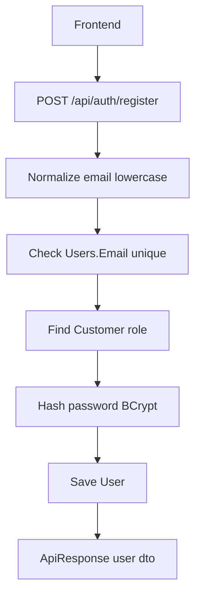

Ket qua:

- User moi co role `Customer`.
- Password khong luu plain text.
- Register khong tao token; frontend can login rieng neu muon vao session.

### Dang Nhap

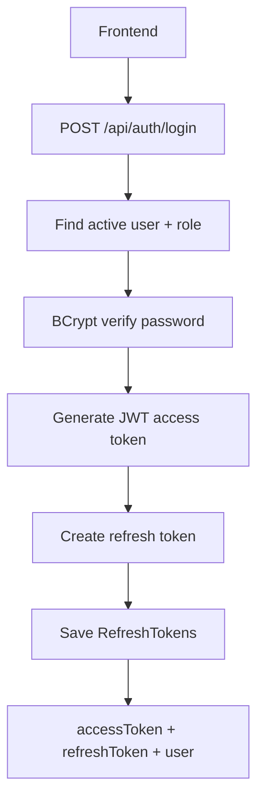

JWT claims:

- `NameIdentifier`: `UserId`.
- `Email`: email.
- `Name`: full name.
- `Role`: `Admin`, `Staff`, `Customer`.

### Refresh Token

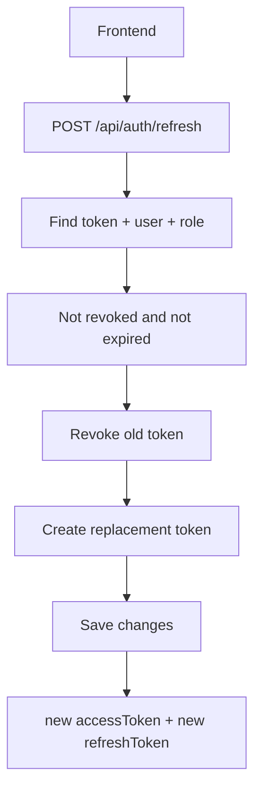

Refresh token duoc rotate, nen frontend phai luu token moi sau moi lan refresh.

### Logout

Logout chi revoke refresh token duoc gui len. Access token cu se het han theo
expiry JWT.

## 7. Product Browse Flow

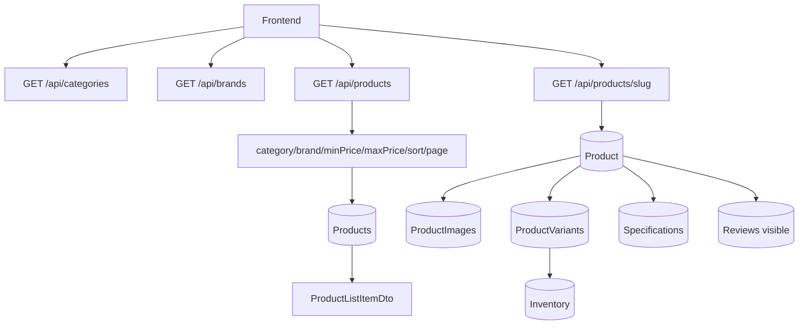

Rule chinh:

- Frontend list/detail nen dung product `slug` cho route detail.
- Product list chi lay `IsActive = true`.
- Product detail chi lay active product va active variants.
- Stock nam o `Inventory.Quantity` theo variant.
- Gia hien thi cua variant = `(SalePrice ?? BasePrice) + PriceOffset`.

## 8. Cart Flow

### Guest Cart

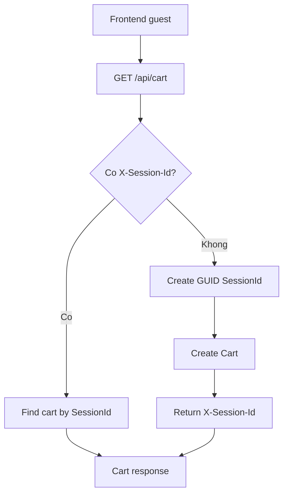

Frontend can luu `X-Session-Id` va gui lai trong request cart sau.

### User Cart

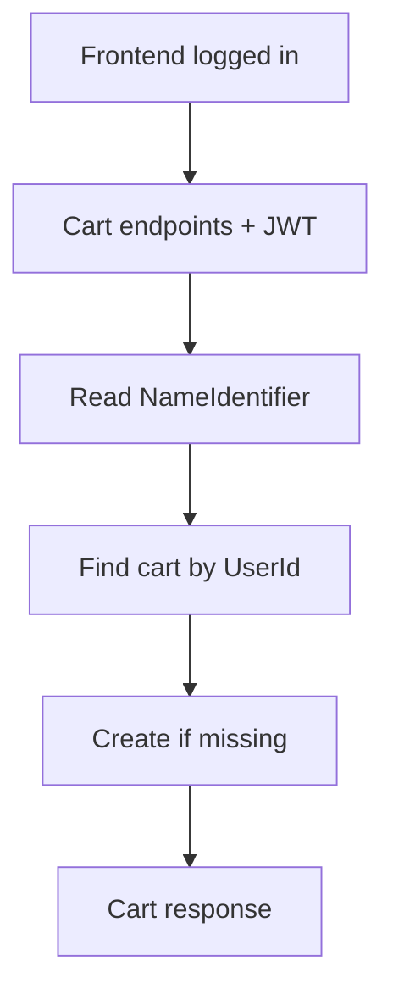

Hien chua co logic merge guest cart vao user cart sau login.

### Add Item

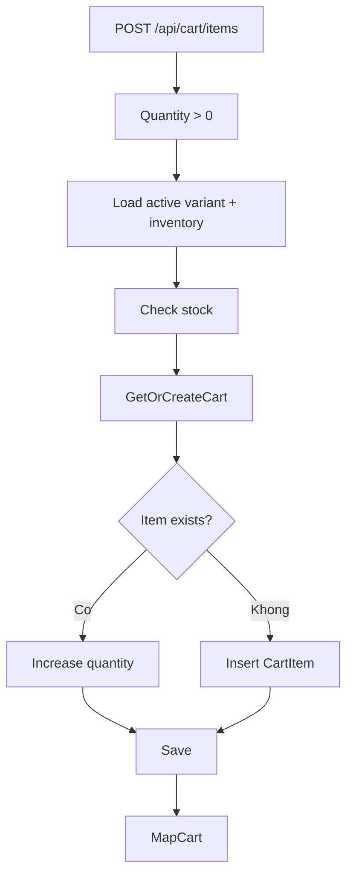

## 9. Coupon Flow

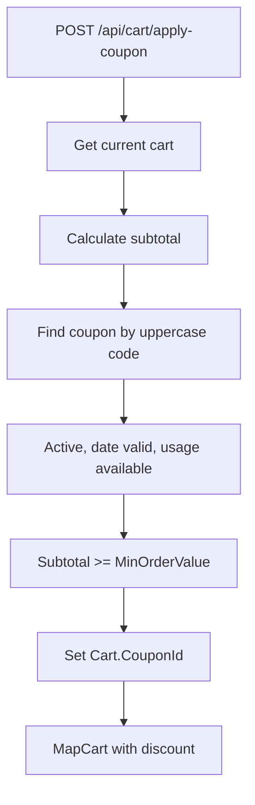

Discount:

- `Percent`: `subtotal * DiscountValue / 100`.
- `Fixed`: `DiscountValue`.
- Neu co `MaxDiscount`, discount bi gioi han bang max.

## 10. Checkout COD Flow

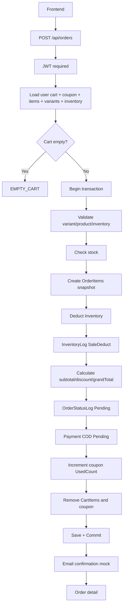

Dieu quan trong:

- Order khong nhan product list tu body, ma lay tu cart hien tai.
- `OrderItem` la snapshot, giu gia va ten san pham tai thoi diem dat.
- Tru kho va tao order nam trong transaction.
- `ShippingFee` hien mac dinh `0`.

## 11. Cancel Order Flow

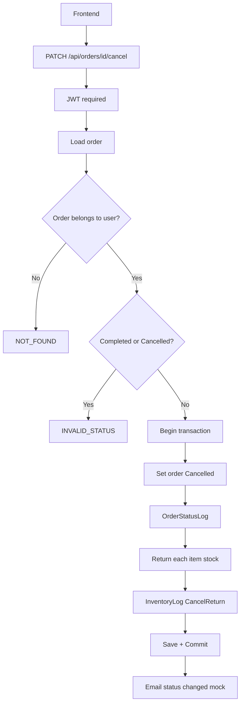

Cancel chi chan `Completed` va `Cancelled`; cac status khac co the bi huy.

## 12. Payment Mock Flow

### Tao Payment URL

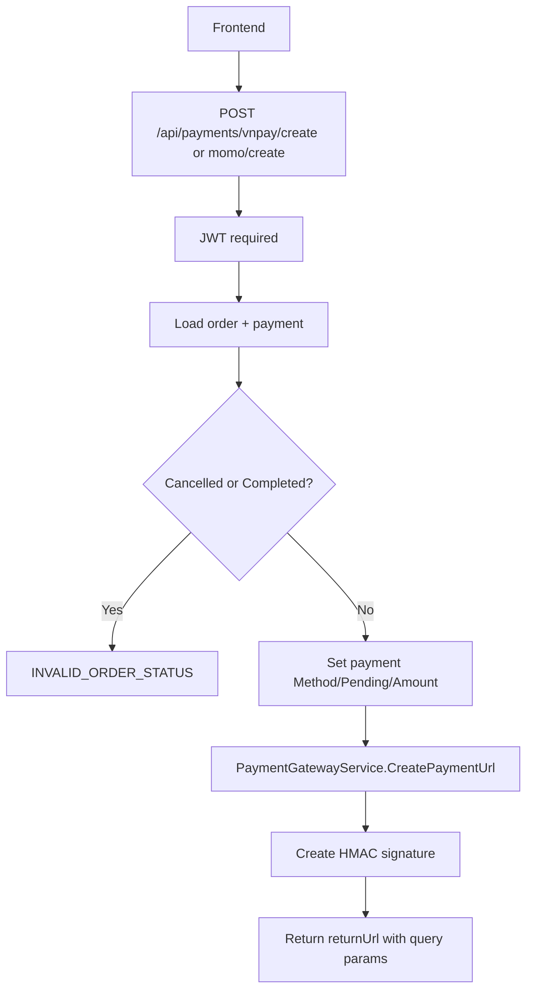

Payment URL mock co query params:

- `paymentId`
- `method`
- `status=Success`
- `transactionCode`
- `signature`

### Callback

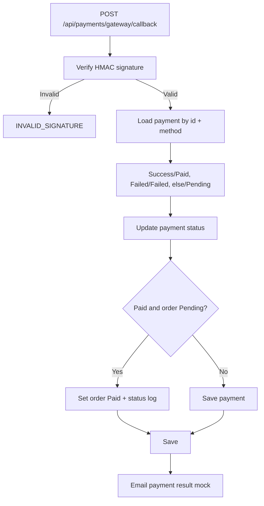

Day la mock gateway, chua goi cong VNPay/Momo that.

## 13. Admin Order Flow

Admin/staff co the:

- List order toan he thong, filter status.
- Cap nhat status bat ky qua `/api/admin/orders/{id}/status`.
- Cap nhat tracking code qua `/api/admin/orders/{id}/tracking`.

Khi update status:

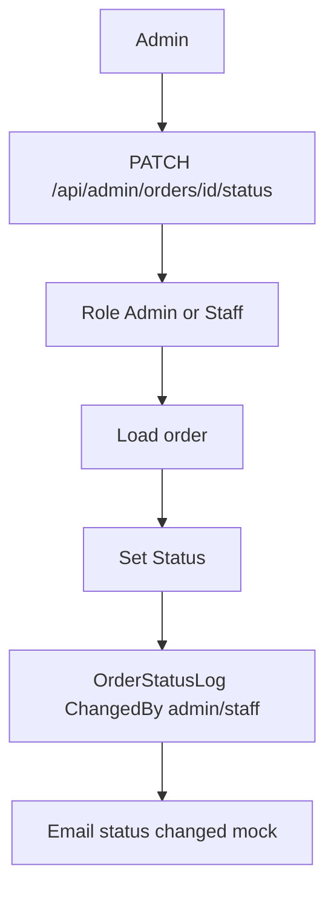

Hien controller chua validate state transition, nen client/admin UI can can than
khi cho chon status.

## 14. Inventory Flow

Inventory chi theo `ProductVariant`, khong theo product tong.

### Import

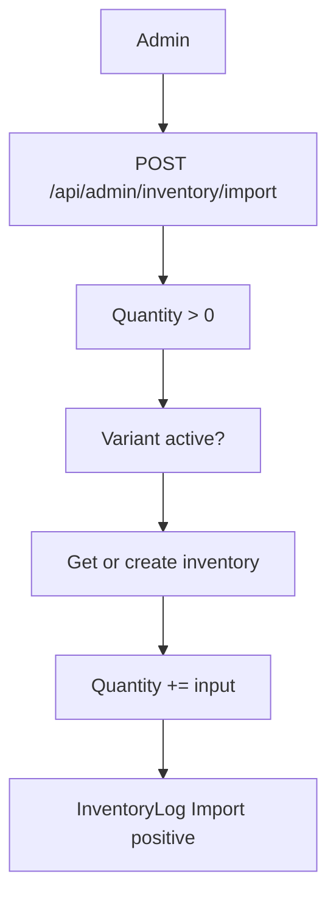

### Export

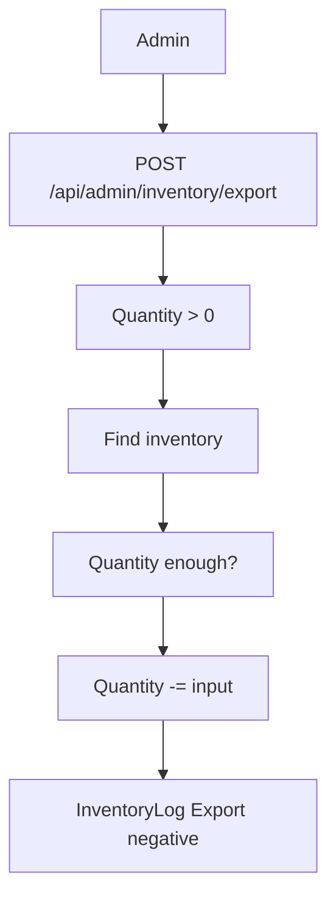

### Adjust

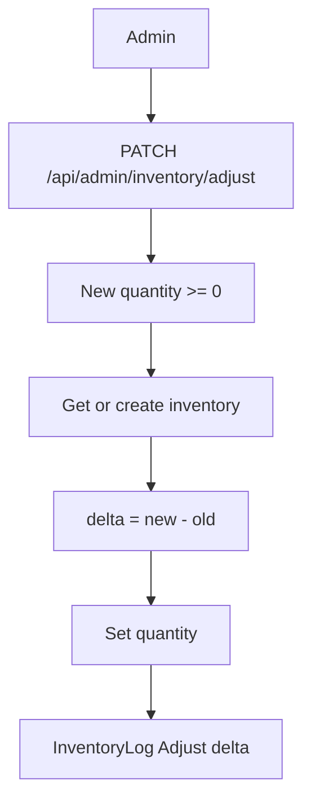

Reports va low stock deu dua vao `Inventory.Quantity` va `LowStockAlert`.

## 15. Promotion Flow

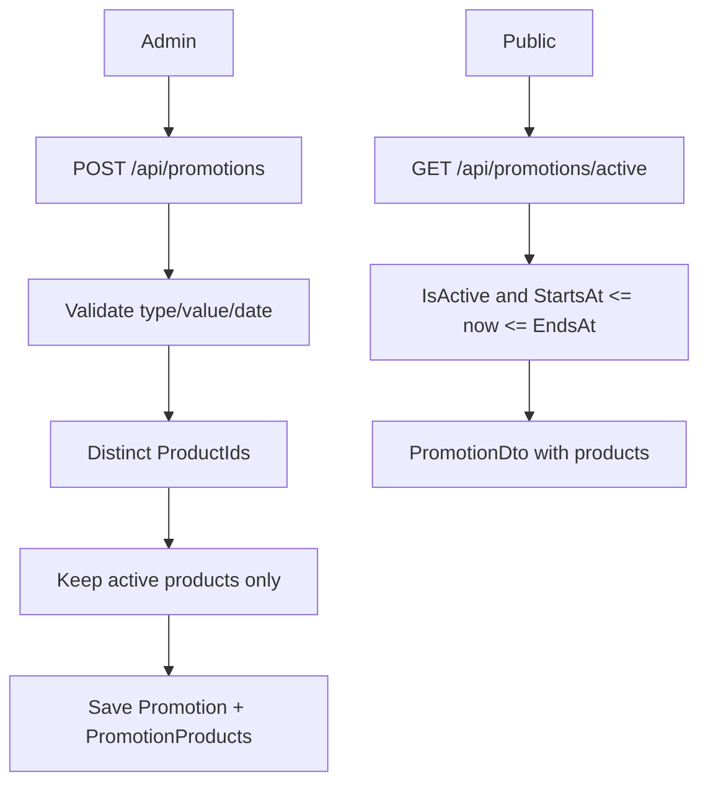

Khi update promotion:

- Validate nhu create.
- Remove tat ca `PromotionProducts` cu.
- Add lai product active tu `productIds` moi.

Delete promotion la soft delete: set `IsActive = false`.

## 16. Review Flow

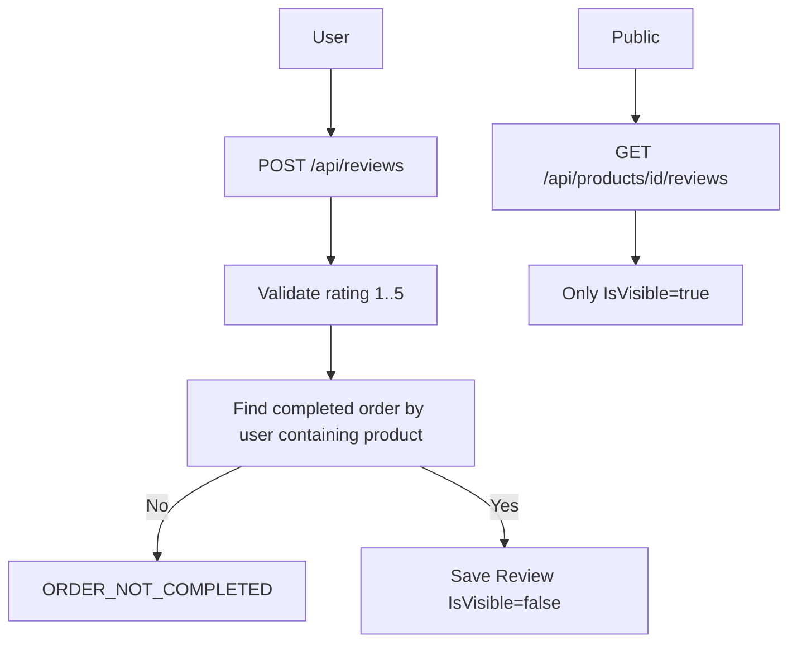

Y nghia:

- User chi review san pham da mua trong don `Completed`.
- Review moi chua public ngay vi `IsVisible = false`.
- Hien chua co API admin de duyet/an review.

## 17. Reports Flow

### Revenue

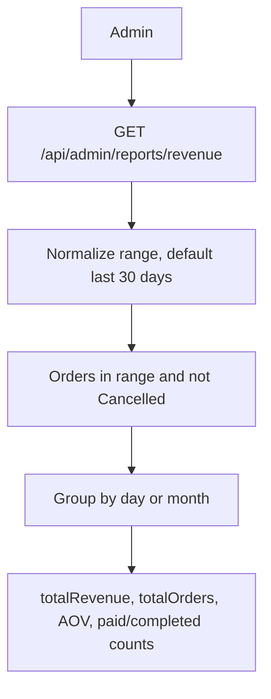

`BuildRevenueReport` tinh doanh thu tu `Order.GrandTotal`.

### Top Products

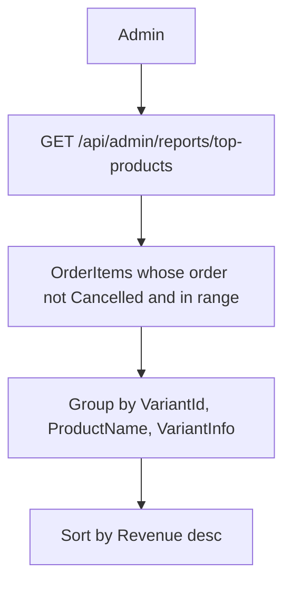

### Low Stock

```mermaid
flowchart TD
    Admin --> Low[GET /api/admin/reports/low-stock]
    Low --> Threshold{threshold provided?}
    Threshold -->|Yes| Custom[Quantity <= threshold]
    Threshold -->|No| Alert[Quantity <= LowStockAlert]
    Custom --> Sort[Order by Quantity]
    Alert --> Sort
```

### Excel Export

`GET /api/admin/reports/revenue/export` dung ClosedXML tao workbook co:

- Sheet `Summary`: range, total revenue, total orders, average order value.
- Sheet `Revenue`: period, revenue, orders.

## 18. Trang Thai Va Gia Tri Enum Dang Dung

Code hien dung string thay vi enum.

Order status dang thay trong flow:

- `Pending`
- `Paid`
- `Completed`
- `Cancelled`

Payment method:

- `COD`
- `VNPay`
- `Momo`

Payment status:

- `Pending`
- `Paid`
- `Failed`

Inventory change type:

- `Import`
- `Export`
- `Adjust`
- `SaleDeduct`
- `CancelReturn`

Discount type:

- `Percent`
- `Fixed`

Role:

- `Admin`
- `Staff`
- `Customer`

## 19. Noi Nen Can Than Khi Sua

- Auth role nam trong JWT claim. Neu doi role name, phai dong bo seed, admin UI va `[Authorize(Roles = ...)]`.
- `RoleId` seed dang duoc code suy luan trong `AuthController.GenerateJwtToken` neu user.Role null: `1 -> Admin`, `2 -> Staff`, con lai `Customer`.
- `DbSeeder` bat exception va chi `Console.WriteLine`, nen loi seed co the bi bo qua khi start.
- `CartController.AddToCart` check stock theo quantity request, chua check tong quantity sau khi cong item cu.
- `CartController.UpdateItem` chua check stock khi doi quantity.
- Payment callback public nhung co HMAC signature; `Payment:CallbackSecret` can duoc bao ve khi deploy.
- Product upload chua validate extension/content-type, chi reject file rong.
- Review public chi hien `IsVisible = true`, nhung chua co API duyet review.
- Admin order status update chua validate transition.
- Secret va SQL password dang nam trong `appsettings.json`; production phai dua sang secret manager/env.

## 20. Lenh Lam Viec Voi Database

Restore/build:

```bash
dotnet restore Backend/api.csproj
dotnet build Backend/api.csproj
```

Apply migration:

```bash
dotnet ef database update --project Backend/api.csproj --startup-project Backend/api.csproj
```

Tao migration moi khi sua model:

```bash
dotnet ef migrations add <MigrationName> --project Backend/api.csproj --startup-project Backend/api.csproj
```

Kiem tra pending model changes neu EF CLI ho tro:

```bash
dotnet ef migrations has-pending-model-changes --project Backend/api.csproj --startup-project Backend/api.csproj
```

Chay backend local:

```bash
dotnet run --project Backend/api.csproj --urls http://localhost:5000
```
