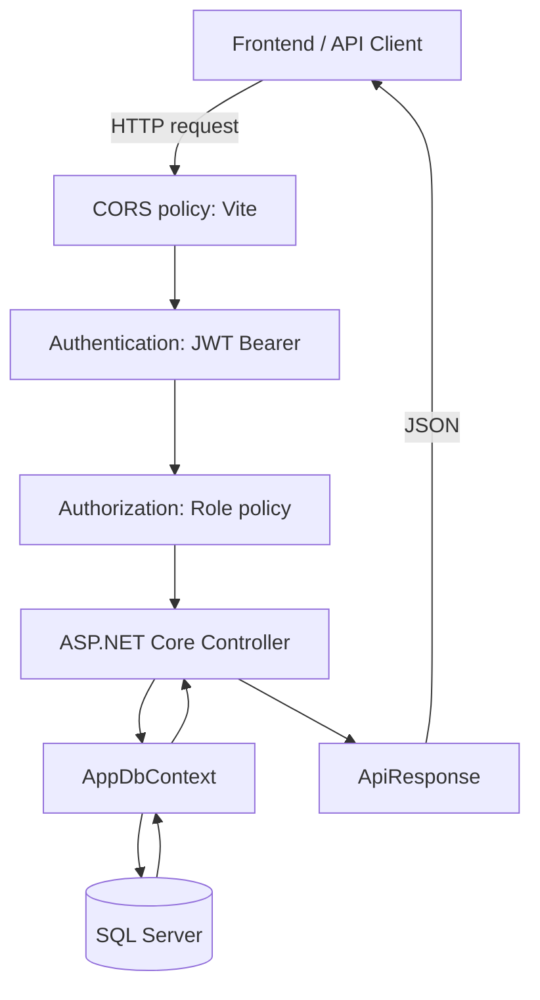
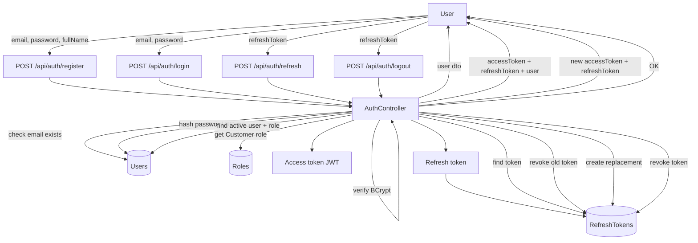
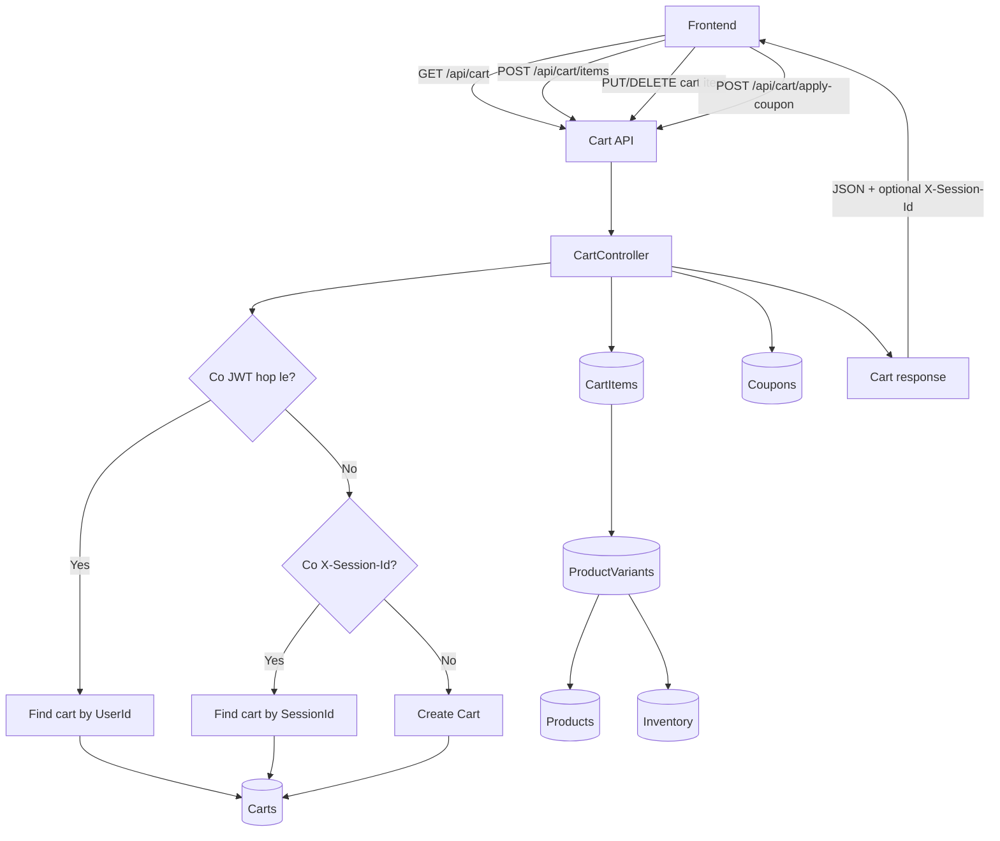
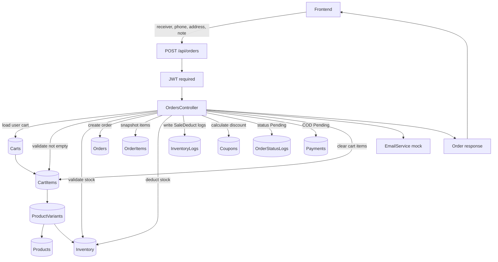
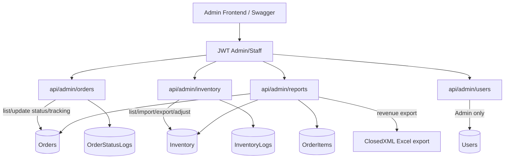
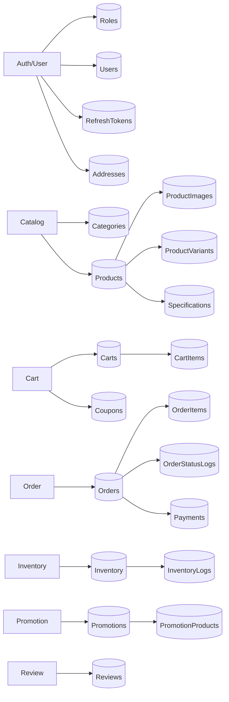
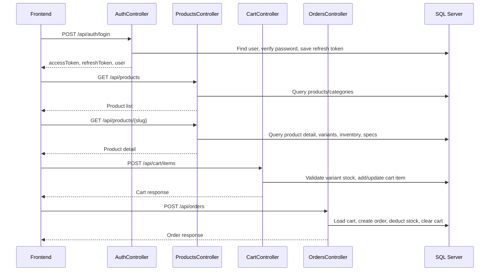

# So do luong du lieu Backend TechShop

Tai lieu nay mo ta cac luong du lieu chinh cua backend TechShop bang Mermaid.
Co the xem truc tiep tren GitHub hoac cac Markdown viewer ho tro Mermaid.

## 1. Tong quan request pipeline

Moi request di vao backend se qua cac middleware trong `Program.cs`, sau do moi den controller.



Ghi chu:

- API public van di qua middleware auth, nhung khong bat buoc co token neu endpoint khong gan `[Authorize]`.
- API admin/staff can JWT co role phu hop.
- Moi response nen theo wrapper `ApiResponse<T>`.

## 2. Luong auth: dang ky, dang nhap, refresh token



Token duoc dung tiep o cac API can dang nhap:

```text
Authorization: Bearer <accessToken>
```

## 3. Luong browse san pham

```mermaid
flowchart TD
    FE[Frontend]
    Categories[GET /api/categories]
    Brands[GET /api/brands]
    ProductList[GET /api/products]
    ProductDetail[GET /api/products/{slug}]
    CategoriesController[CategoriesController]
    BrandsController[BrandsController]
    ProductsController[ProductsController]
    CategoryTable[(Categories)]
    ProductTable[(Products)]
    ProductImages[(ProductImages)]
    ProductVariants[(ProductVariants)]
    Inventory[(Inventory)]
    Specs[(Specifications)]
    Reviews[(Reviews)]

    FE --> Categories
    Categories --> CategoriesController
    CategoriesController --> CategoryTable
    CategoriesController -->|category tree| FE

    FE --> Brands
    Brands --> BrandsController
    BrandsController --> ProductTable
    BrandsController -->|distinct brands| FE

    FE -->|category, brand, price, sort, page| ProductList
    ProductList --> ProductsController
    ProductsController --> ProductTable
    ProductsController --> CategoryTable
    ProductsController -->|paged product list| FE

    FE -->|slug| ProductDetail
    ProductDetail --> ProductsController
    ProductsController --> ProductTable
    ProductsController --> ProductImages
    ProductsController --> ProductVariants
    ProductVariants --> Inventory
    ProductsController --> Specs
    ProductsController --> Reviews
    ProductsController -->|detail dto| FE
```

Diem quan trong:

- List san pham dung filter query string.
- Chi tiet san pham dung `slug`, khong dung id so.
- Gia variant = `SalePrice/BasePrice + PriceOffset`.
- Stock nam o `Inventory` theo tung variant.

## 4. Luong cart cho guest va user da dang nhap



Rule chinh:

- Guest cart duoc dinh danh bang header `X-Session-Id`.
- User cart duoc dinh danh bang `UserId` trong JWT.
- Them vao gio can `VariantId`, khong phai `ProductId`.
- Backend kiem tra stock truoc khi them vao gio.
- Coupon duoc tinh theo subtotal cua cart.

## 5. Luong checkout COD va tao order



Ket qua sau khi checkout:

- Tao `Order`.
- Tao cac `OrderItem`.
- Tru ton kho trong `Inventory`.
- Ghi log tru kho trong `InventoryLogs`.
- Tao `Payment` mac dinh `COD/Pending`.
- Clear cart item cua user.
- Goi mock email confirmation.

## 6. Luong huy don

```mermaid
flowchart TD
    FE[Frontend]
    CancelApi[PATCH /api/orders/{id}/cancel]
    OrdersController[OrdersController]
    Orders[(Orders)]
    OrderItems[(OrderItems)]
    Inventory[(Inventory)]
    InventoryLogs[(InventoryLogs)]
    StatusLogs[(OrderStatusLogs)]
    Email[EmailService mock]
    Response[Cancel response]

    FE -->|JWT| CancelApi
    CancelApi --> OrdersController
    OrdersController -->|load order of current user| Orders
    Orders --> OrderItems
    OrdersController -->|reject Completed/Cancelled| OrdersController
    OrdersController -->|set Cancelled| Orders
    OrdersController -->|return stock| Inventory
    OrdersController -->|write CancelReturn logs| InventoryLogs
    OrdersController -->|write status log| StatusLogs
    OrdersController --> Email
    OrdersController --> Response
    Response --> FE
```

## 7. Luong payment VNPay/Momo mock

```mermaid
flowchart TD
    FE[Frontend]
    CreatePayment[POST /api/payments/vnpay/create or momo/create]
    PaymentsController[PaymentsController]
    Orders[(Orders)]
    Payments[(Payments)]
    Gateway[PaymentGatewayService mock]
    PaymentUrl[Mock payment URL]
    Callback[POST /api/payments/{gateway}/callback]
    Verify[Verify HMAC signature]
    StatusLogs[(OrderStatusLogs)]
    Email[EmailService mock]

    FE -->|orderId, returnUrl, JWT| CreatePayment
    CreatePayment --> PaymentsController
    PaymentsController -->|load order + payment| Orders
    Orders --> Payments
    PaymentsController -->|set method/status Pending| Payments
    PaymentsController --> Gateway
    Gateway --> PaymentUrl
    PaymentUrl --> FE

    FE -->|redirect/mock callback| Callback
    Callback --> PaymentsController
    PaymentsController --> Verify
    Verify -->|invalid| FE
    Verify -->|valid| Payments
    PaymentsController -->|Paid/Failed/Pending| Payments
    PaymentsController -->|if Paid and order Pending, set order Paid| Orders
    PaymentsController --> StatusLogs
    PaymentsController --> Email
    PaymentsController --> FE
```

Payment hien chua tich hop cong thanh toan that. Day la mock gateway de test luong tao giao dich va callback.

## 8. Luong admin quan ly don, kho va bao cao



Quyen:

- `Admin,Staff`: admin orders, inventory, reports.
- `Admin`: user management.

## 9. Ban do bang du lieu theo chuc nang



## 10. Tom tat luong end-to-end quan trong nhat



